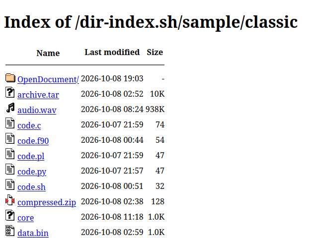
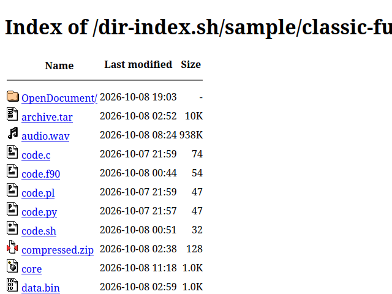

# dir-index.sh

Generate static directory index files for web hosts without access to
Apache/nginx autoindex.

## Usage

```
Usage: dir-index.sh [OPTION]... [DIR]...
Generate directory index files for DIR(s) and subdirectories under
DIR(s).

General options:
  -g FILE       read directories to index from FILE:
                  * directories are delimited by NUL, not newline
                  * if FILE is -, directories are read from standard
                    input
  -f            overwrite existing directory index files
  -V            display version information and exit
  -h            display this help text and exit

Indexing options:
  -i PATTERN    ignore files and directories matching shell PATTERN
                when indexing a directory (can be used multiple times)
  -I FILE       read ignore patterns from FILE:
                  * patterns are delimited by NUL, not newline
                  * if FILE is -, patterns are read from standard
                    input
  -T OPTIONS    comma-separated list of option keywords:
                  * ignore-dot: ignore dot files (.*) (default)
                  * no-ignore-dot: do not ignore dot files
                  * ignore-includes: ignore files included with -E, -D
                    or -R (see HTML-specific output options) (default)
                  * no-ignore-includes: do not ignore files included
                    with -E, -D or -R

  -k PATTERN    skip directories matching shell PATTERN and their
                subdirectories when searching for directories to index
                (can be used multiple times)
  -K FILE       read skip patterns from FILE:
                  * patterns are delimited by NUL, not newline
                  * if FILE is -, patterns are read from standard
                    input
  -W OPTIONS    comma-separated list of option keywords:
                  * skip-dot: skip dot directories (.*) (default)
                  * no-skip-dot: do not skip dot directories
                  * skip-ignores: apply ignore patterns to skip
                    directories
                  * no-skip-ignores: do not apply ignore patterns to
                    skip directories (default)

  Ignore patterns (-i and -I) and skip patterns (-k and -K) match base
  names only. If a path is given, all leading directories will be
  removed from the pattern.

Output options:
  -o NAME       use NAME for directory index files
  -O FORMAT     use FORMAT for directory index files:
                  * valid values: html (default), xml, json

  -s COLUMN     sort by COLUMN:
                  * valid values: name (default), modified, size
  -S OPTIONS    comma-separated list of option keywords:
                  * asc: sort ascending (default)
                  * desc: sort descending
                  * version: enable version sort (default)
                  * no-version: disable version sort
                  * case: case-sensitive sort (default)
                  * no-case: case-insensitive sort (requires
                    no-version)
                  * folders-first: list directories first
                  * no-folders-first: list files and directories
                    together (default)

  -F            update directory mtimes when creating index files

HTML-specific output options:
  -y STYLE      use built-in STYLE:
                  * none (default)
                  * classic
                  * classic-full

  -t TITLE      use TITLE for page title (<title>)
  -w DIR        use DIR for page text direction (<html dir="...">)
  -l LANG       use LANG for page language (<html lang="...">)
  -A CHARSET    specify CHARSET for <meta charset="...">
  -e HTML       include HTML in <head> (can be used multiple times)

  -d TEXT       use TEXT for header
  -x TEXT       use TEXT for breadcrumbs root link
  -r TEXT       use TEXT for readme

  -E FILE       include content from FILE in <head>
  -D FILE       include content from FILE in place of header
  -R FILE       include content from FILE in place of readme

                for -E, -D and -R:
                  * FILE is a base name: for each directory to be
                    indexed, if FILE exists in the directory then it
                    will be included in that directory's index file
                  * FILE is a path (relative or absolute): the file at
                    that path will be included in every directory
                    index file
                  * FILE is -: content will read from standard input
                    and included in every directory index file

  -C COLUMNS    comma-separated list of columns to include:
                  * valid values: name, modified, size

  -N TEXT       use TEXT for file name column heading

  -m FORMAT     use FORMAT for file last modified dates:
                  * same syntax as 'date' command output format string
  -u            output last modified dates in UTC
  -M TEXT       use TEXT for last modified column heading

  -z UNIT       use UNIT for file sizes:
                  * none (exact size)
                  * si (1k = 1000, 1M = 1000000, ...)
                  * iec (1K = 1024, 1M = 1048576, ...) (default)
                  * iec-i (1Ki = 1024, 1Mi = 1048576, ...)
  -Z TEXT       use TEXT for size column heading

  -P TEXT       use TEXT for parent directory link

  -X PATH       index DIR as if it is located at PATH instead of at
                web server root:
                  * should be an absolute path
  -H OPTIONS    comma-separated list of option keywords:
                  * table: output directory listing as a table
                    (default)
                  * list: output directory listing as a list of names
                    only
                  * rules: output horizontal rule lines (<hr>) in
                    index table (default)
                  * no-rules: omit horizontal rule lines (<hr>) in
                    index table
                  * preamble: include opening and closing HTML
                    (default)
                  * no-preamble: omit opening HTML (<html>, <head>,
                    etc.) when including file content with -D, and
                    omit closing HTML (</body></html>) when including
                    file content with -R

XML-specific output options:
  -G ENCODING   specify ENCODING in XML declaration
                (<?xml encoding="..."?>)
```

## Built-in styles

* [classic][] - Apache style with most common icons

  <a href="https://jefferyto.github.io/dir-index.sh/sample/classic/"></a>

* [classic-full][] - Apache style with all default icons

  <a href="https://jefferyto.github.io/dir-index.sh/sample/classic-full/"></a>

[classic]: https://jefferyto.github.io/dir-index.sh/sample/classic/
[classic-full]: https://jefferyto.github.io/dir-index.sh/sample/classic-full/

## Dependencies

* [bash][] or [dash][], possibly other Bourne-like shells
* GNU [coreutils][], [findutils][] and [sed][]
* file, either [Ian Darwin][Ian Darwin file], [OpenBSD][OpenBSD file] or
  [macOS][macOS file] implementation
* [jq][]

[bash]: https://www.gnu.org/software/bash/
[dash]: http://gondor.apana.org.au/~herbert/dash/
[coreutils]: https://www.gnu.org/software/coreutils/
[findutils]: https://www.gnu.org/software/findutils/
[sed]: https://www.gnu.org/software/sed/
[Ian Darwin file]: https://www.darwinsys.com/file/
[OpenBSD file]: https://man.openbsd.org/file.1
[macOS file]: https://ss64.com/mac/file.html
[jq]: https://jqlang.org/

## Changelog

See [NEWS][].

[NEWS]: NEWS.md

## License

Copyright (C) 2026  The dir-index.sh authors  
<https://github.com/jefferyto/dir-index.sh>

This program is free software; you can redistribute it and/or modify
it under the terms of the GNU General Public License as published by
the Free Software Foundation; either version 2 of the License, or
(at your option) any later version.

This program is distributed in the hope that it will be useful,
but WITHOUT ANY WARRANTY; without even the implied warranty of
MERCHANTABILITY or FITNESS FOR A PARTICULAR PURPOSE.  See the
GNU General Public License for more details.

You should have received a copy of the GNU General Public License along
with this program; if not, see <https://www.gnu.org/licenses/>.
